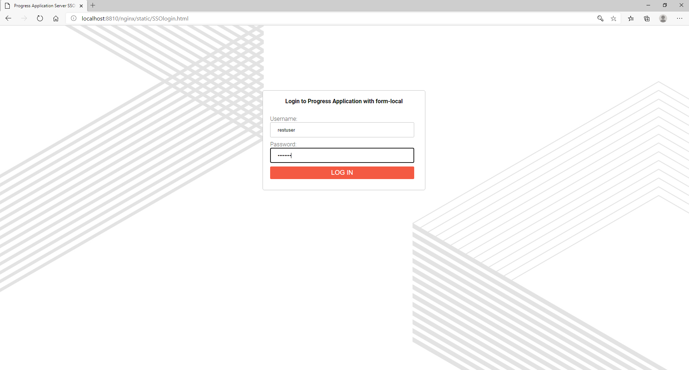
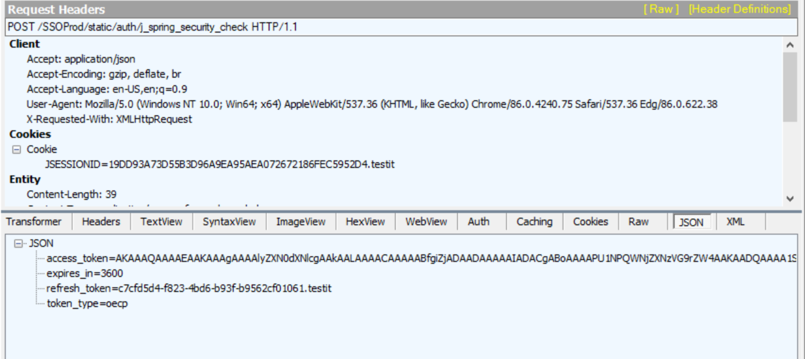
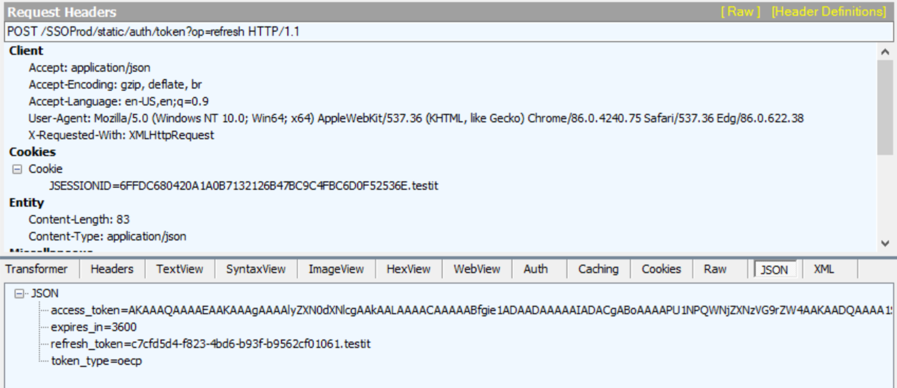
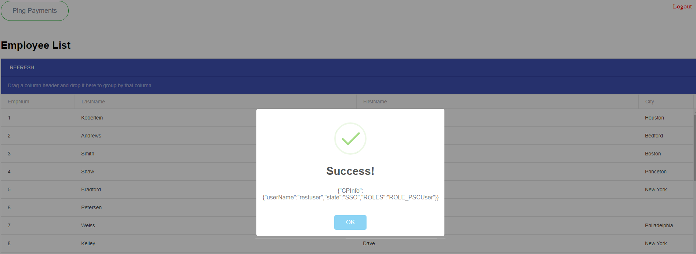

# HTTPSSO
Progress Application Server for OpenEdge provides various options for users to authenticate their Applications with enterprise servers. In this example, we are going to cover HTTP SSO functionality. The ABLApp Name is "SSOApp" and it is going to be consisting of 3 WebApps. In this example, we are going to build SSOApp and also compile the ABL code with the available version of OpenEdge.

# Build the OEAR
1. Open proenv command, navigate to HTTPSSO folder and then type proant command
```sh
   cd HTTPSSO
   proant
```
2. The OEAR artefact will be generated in HTTPSSO/build/oear folder.

# Import the OEAR

The OEAR for the SSO App has three webapps </br>
    - nginx </br>
    - SSOProd </br>
    - Payments </br>

<b>nginx</b> - deployed with static content(html/javascript) </br>
<b>SSOProd</b> - WebApp to produce and refresh HTTP SSO tokens with form-local authentication </br>
<b>Payments</b> - ABL Service that consumes the SSO token, validates and executes the Application logic </br>

1. To import the OEAR, create a PAS Instance and import the OEAR. For our use-case, we do not need a default ABL Application, hence creating just a PAS instance.

```sh
    pasman create -Z pas oepas
```

2. Now import the OEAR to the PASOE Instance

```sh
   cd oepas/bin
   ./tcman.sh import $HOME/HTTPSSO/build/oear/SSOApp-1.0.0-ALPHA.oear
```

SSOApp should be imported successfully. In addition to deploying the webapps for the SSOApp, it will also compile the ABL Code and create the database used for this ABL Application.

# Test SSOApp
The SSOApp will require a database and should be started with the instance. That is taken care by the startup scripts so to get everything up and running, start the PASOE Instance

```sh
  cd oepas/bin
  ./tcman.sh pasoestart -restart 
```

1. Once the PASOE Instance is started, access the URL - http://localhost:8810/nginx/static/SSOlogin.html


Enter the credentials(restuser/password) and click on "LOG IN".

</br>


2. Once the user clicks on "LOG IN" we perform form-login and get SSO token. We can find the raw request and response information here

</br>


3. The token is stored for the user session and when the Payments webapp is accessed, it sends the token in the header.

</br>


4. Now, click on the "Refresh" button and that should make a call to "SSOProd" webapp and generate a new token.

</br>


5. In-order to verify that the user session is available and we are getting the right credentials, click on the "Ping Payments" button. It should perform SSO and provide the Client-Principal Object information in a JSON format.

 </br>

